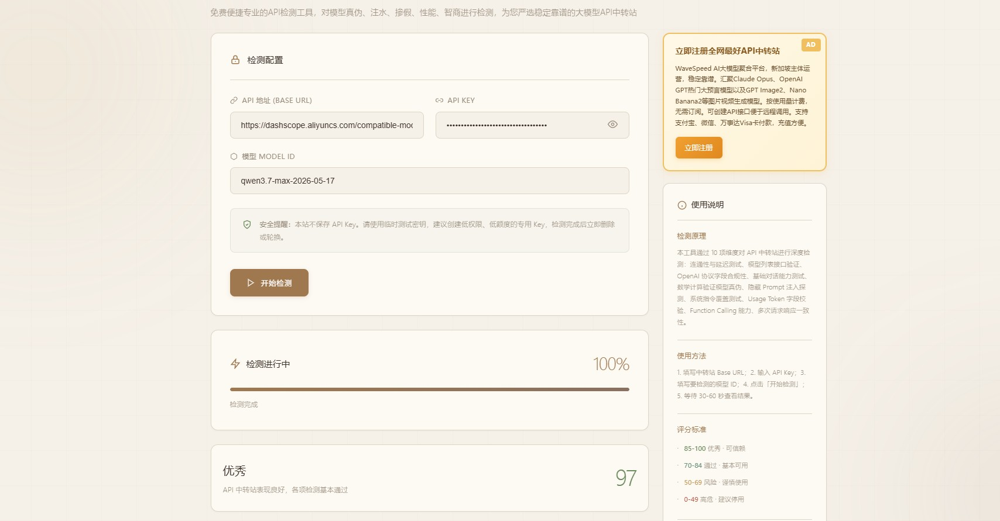
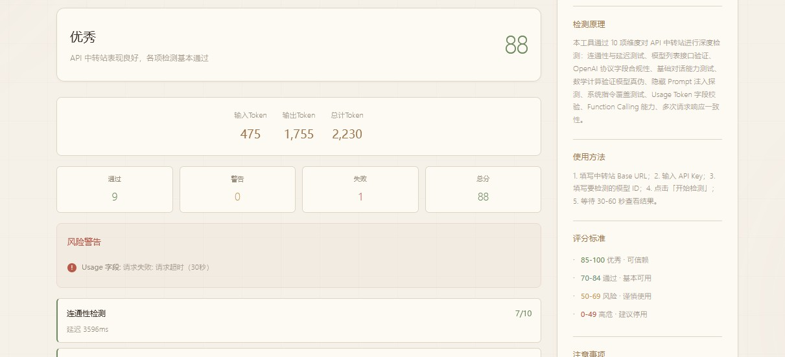
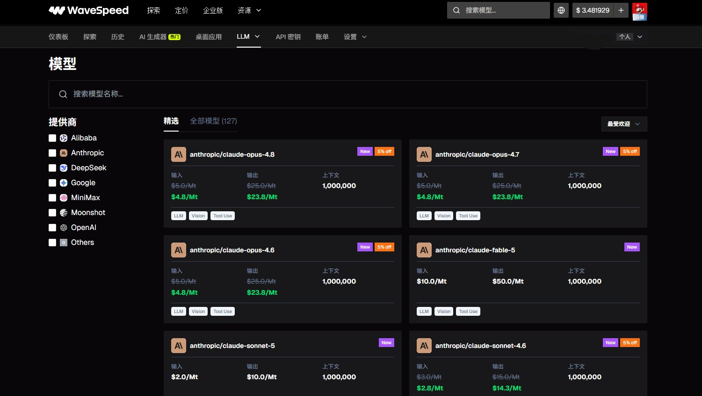
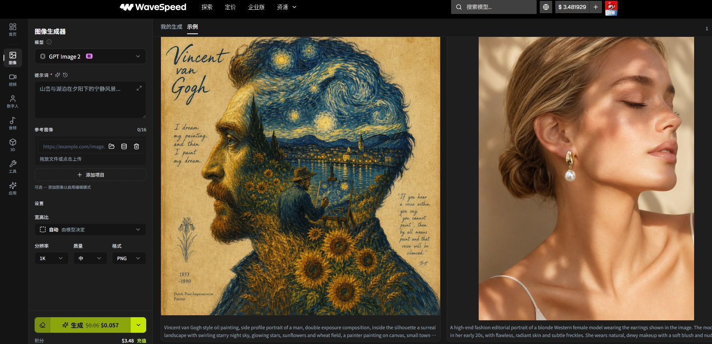
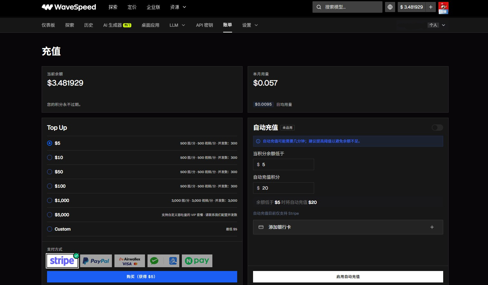

# 30秒一键检测！大模型中转站真假/注水/掺水/以次充好检测工具，专业稳定靠谱AI中转站聚合平台严选推荐！

## 为解决用户选购稳定靠谱的中转站聚合平台而生

AI大模型中转站已经是很多企业工作室用户的刚需。而面对目前市面上良莠不齐的API中转站市场，也确实让人抓耳挠腮的，这家到底靠不靠谱啊？有没有掺假注水以次充好啊？会不会随时跑路啊？

消费者不是怕花钱，而是怕花冤枉钱。事实是很多大模型中转站为了利润最大化，利用技术手段搞了一些猫腻，坑害消费者。作为普通用户，大多数人也许只能在价格上进行比较，无法对大模型API质量进行质量评估。而这就需要有一款普通人技术小白也能方便使用的“AI大模型API中转站检测工具”来对某一中转站进行检测，对是否确认使用该中转站进行一个评估参考。

## 巴士哥中转站质量检测小工具

这里我推荐这款“**[巴士哥AI大模型API中转站真假/注水/掺水检测工具](https://apitest.bashige.com/)**”，这款工具从10项技术维度对API进行检测，最后给出一个满分为100分的评分，用户可根据评分决定要不要使用这家API中转站。通过10项维度对API中转站进行深度检测：连通性与延迟测试、模型列表接口验证、OpenAI协议字段合规性、基础对话能力测试、数学计算验证模型真伪、隐藏Prompt注入探测、系统指令覆盖测试、Usage Token字段校验、Function Calling能力、多次请求响应一致性。

这款工具的使用方法也特别简单，仅需输入API接口的Base Url、Api Key、Model ID这三项，然后点击开始检测按钮，大约运行30秒左右就可以查看检测报告。

评分标准：

- **85-100** 优秀 · 可信赖
- **70-84** 通过 · 基本可用
- **50-69** 风险 · 谨慎使用
- **0-49** 高危 · 建议停用

平台不会保存用户的敏感Api Key信息，但还是建议使用一个临时的Api Key，测试完立即删除。当然了，此工具也并不是说100%准确，起到一个参考的作用吧，反正测试一下也没事，总比不测试好吧。

**2026年7月6日更新**：支持Claude Fable 5模型检测。

## 专业稳定靠谱AI中转站聚合平台严选推荐！
经过对市面上数百家中转站进行严苛测试，大部分多少都有注水掺水的情况，不过注水掺水这还不是问题所在，关键的是一些价格低的吓人的聚合平台往往使用不正规甚至非法的方式搞到的API，用New API套个壳就开始销售，也不乏一些卷钱跑路的。对于企业、工作室等专业用户来说，稳定才是王道，不能为了贪图低廉的价格影响自己工作进度不是？

这里推荐WaveSpeed AI这款由新加披公司主体运营的AI大模型聚合平台，他家公司名称和办公地址均在其网站上有注明，不是那种小作坊能比的。运营的模型数百款，市面上有的他家都有，例如Claude Opus、Fable 5、Google Gemini、OpenAI GPT系列大预言模型、GPT Image2、Nano Banana2等图片生成模型、Seedance 2.0、HappyHorse、Kling、Luma AI等视频生成模型等。支持支付宝、微信、万事达Visa卡付款，充值方便。

**[立即注册WaveSpeed体验测试](https://wavespeed.ai/?ref=git)**

