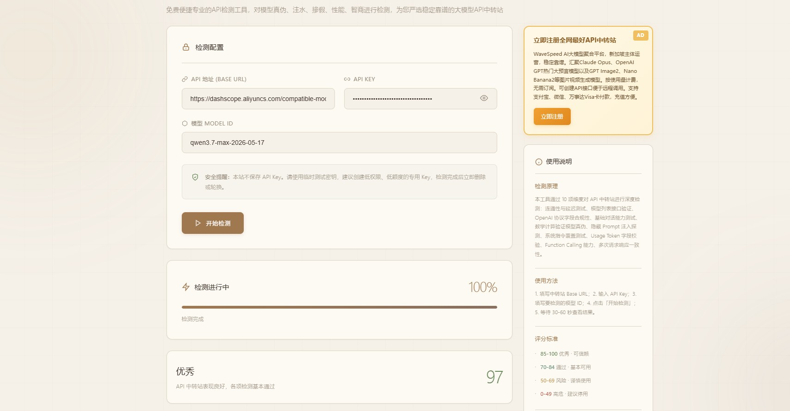

# 30秒一键检测！大模型中转站API真假/注水/掺水/以次充好检测工具网站

## 为用户严选稳定靠谱的大模型API中转站而生

AI大模型中转站已经是很多企业工作室用户的刚需。而面对目前市面上良莠不齐的API中转站市场，也确实让人抓耳挠腮的，这家到底靠不靠谱啊？有没有掺假注水以次充好啊？会不会随时跑路啊？消费者不是怕花钱，而是怕花冤枉钱。事实是很多大模型中转站为了利润最大化，利用技术手段搞了一些猫腻，坑害消费者。作为普通用户，大多数人也许只能在价格上进行比较，无法对大模型API质量进行质量评估。而这就需要有一款普通人技术小白也能方便使用的“AI大模型API中转站检测工具”来对某一中转站进行检测，对是否确认使用该中转站进行一个评估参考。

## 巴士哥中转站质量检测工具

这里我推荐这款“**[巴士哥AI大模型API中转站真假/注水/掺水检测工具](https://apitest.bashige.com/)**”。

这个工具可不是简单的连通性测试，而是模拟真实业务请求对API中转站进行10个维度的深度体检，帮你一站式搞定模型注水与API掺水检测。我们先从基础的连通性与延迟测试看起，评估线路质量，再结合模型列表接口验证排查伪造清单的障眼法。接着深入底层，用OpenAI协议字段合规性检测与基础对话能力测试，揪出二次包装引发的兼容故障和基础罢工。到了最核心的真伪鉴别环节，我们会用123×456的数学计算让以次充好的小模型原形毕露，并在温度0下连问3次相同问题，通过多次请求响应一致性测试精准打击把请求轮询到不同后端的套路。针对中转站喜欢搞的小动作，隐藏Prompt注入探测和系统指令覆盖测试能敏锐捕捉偷偷插播广告或篡改你指令的违规行为。最后，Usage Token字段校验和Function Calling能力测试双管齐下，既严查token计费虚报，又通过工具调用验证协议透传的完整性，全方位确保你的中转站纯净可靠，让每次调用都明明白白。

这款工具的使用方法也特别简单，仅需输入API接口的Base Url、Api Key、Model ID这三项，然后点击开始检测按钮，大约运行30秒左右就可以查看检测报告。评分标准：

- 85-100 优秀 · 可信赖
- 70-84 通过 · 基本可用
- 50-69 风险 · 谨慎使用
- 0-49 高危 · 建议停用

平台不会保存用户的敏感Api Key信息，但还是建议使用一个临时的Api Key，测试完立即删除。当然了，此工具也并不是说100%准确，起到一个参考的作用吧，反正测试一下也没事，总比不测试好吧。

- 2026年7月6日更新：新增支持Claude Fable 5模型检测
- 2026年11月6日更新：修复了一些Bug，让监测更准确。移除了碍眼的Google Adsense广告，让界面更简洁友好。添加了卜算子访客数据统计，根据真实IP统计本监测工具网站真实访客数量。
- 2026年11月11日更新：添加了10项检测原理的详细解说，让用户了解中转站掺水检测的检验逻辑。以及评分标准与结果解读进行详细阐述。添加了常见问题与回答。
- 2026年11月19日更新：重新设计并优化了页面布局。

